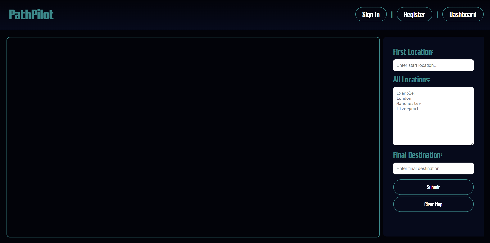
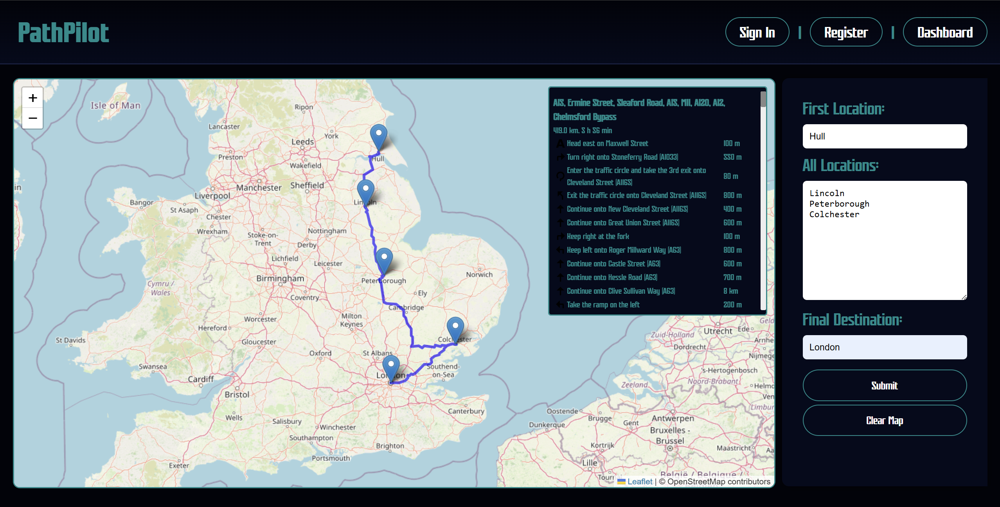
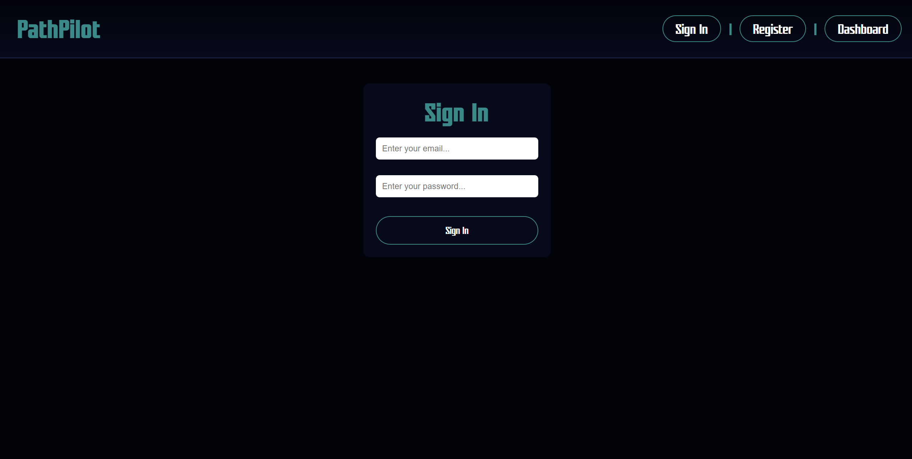
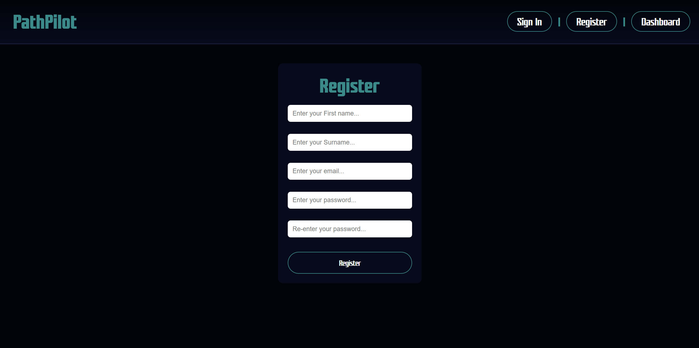

# PathPilot
## Overview
PathPilot would provide a platform for analysing delivery locations, calculating the most efficient routes, and minimising travel time and distance. By incorporating geographic data and dynamic routing strategies, PathPilot helps delivery teams reduce fuel costs, improve delivery times, and manage multiple delivery vehicles more effectively. Ideal for logistics operations and courier services. It will also provides a scalable foundation for real-time route adjustments, traffic-aware navigation, and priority-based scheduling in future iterations.

## Layout/Plan
### Basic functionaility 
1. Allow users to login
    - Users create login credentials which are stored in a datebase
    - Users can then log in upon usage of the website at another time
1. Allow users to input locations 
    - User enters multiple delivery stops with addresses
    - Input start and end locations
2. Geocoding
    - Convert addresses to lat/long
3. Single Route Optimization
    - Optimize route for fastest time 
4. Routing Map Display
    - Show optimized route on interactive map

### Improvements/Further functionality
1. Live Traffic Data
    - Use OpenStreetMap API
2. Priority Orders
    - Route high-priority stops first

## Final Showcase
### Dashboard

### Route Optimisation Dashboard
*Dashboard with user inputs showing optimized route generation and ETA panel.*

### Sign In and Register Pages

